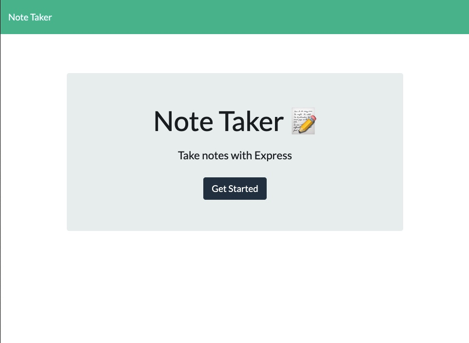
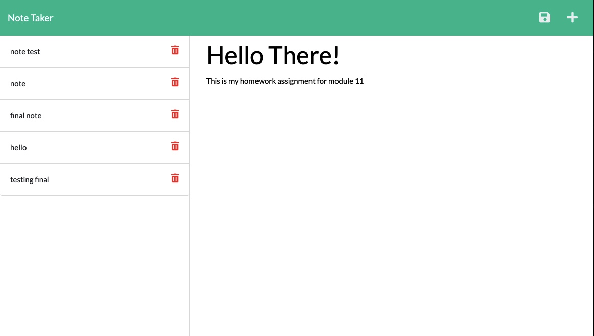

# Track Your Notes!

## Description 

This application uses an Express.js back end and will save and retrieve notes created by the user, and data, from a JSON file. The user will be able to write and save their notes and thoughts so that they can easily keep track of them.

Please access the note taking application at http://localhost:3001/notes

&nbsp;  

## Installation

What are the steps required to install your project? Provide a step-by-step description of how to get the development environment running.

&nbsp;  

## Usage 

After launching the application, and upon viewing it on localhost:3001, create a note for yourself by typing it in and then click on the floppy disk to save it. 

&nbsp;  

## Tools 

* Express.js
* Node.js
* Heroku

&nbsp;  

## Contributing

Open to all. 

&nbsp;  

## Thank You
Please feel free to contact me with any additional questions: 
* GITHUB: https://www.github.com/winterkanda
* EMAIL: <mailto: kirankanda06@gmail.com>
### @2021 Winter